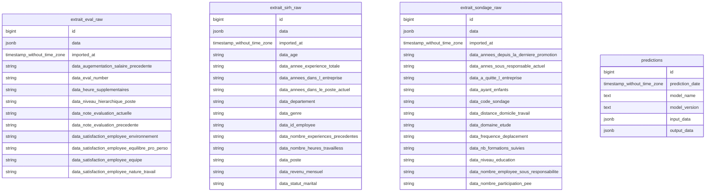

# Documentation complémentaire du schéma de base de données

## 1. Rôle métier des tables

La base de données PostgreSQL a été conçue pour répondre à deux besoins principaux :  
- stocker les données sources brutes issues de différents fichiers CSV 
- historiser les prédictions produites par le modèle de machine learning

### Tables de données brutes

#### `extrait_eval_raw`
Contient les données issues des évaluations des employés.  
Ces données peuvent inclure des indicateurs de performance, de satisfaction ou d’évolution.

#### `extrait_sirh_raw`
Contient les données issues du système d’information des ressources humaines (SIRH), telles que les informations administratives ou professionnelles des employés.

#### `extrait_sondage_raw`
Contient les données issues de questionnaires ou sondages internes (ex : satisfaction, engagement, conditions de travail).

Ces trois tables jouent un rôle de **zone de staging** (zone d’atterrissage des données brutes).

---

### Table métier

#### `predictions`
Cette table centralise les résultats des prédictions générées par l’API.

Elle permet de :
- conserver un historique des appels au modèle 
- tracer les données d’entrée (`input_data`)
- enregistrer les résultats (`output_data`)
- identifier le modèle utilisé (`model_name`, `model_version`)
- connaître la date de prédiction

Cette table joue un rôle de **journal de prédictions (log métier)**.

---

## 2. Choix du format JSONB

Les données sont stockées dans des colonnes de type `JSONB`.

### Pourquoi ce choix ?

- Les fichiers CSV sources peuvent avoir :
  - des structures différentes
  - des colonnes variables
  - des données incomplètes

- Le format `JSONB` permet :
  - de stocker les données **sans transformation immédiate**
  - de conserver la structure originale
  - de faciliter l’ingestion rapide de données volumineuses
  - de rester flexible face à l’évolution des données

- PostgreSQL offre :
  - de bonnes performances avec `JSONB`
  - des possibilités d’indexation (GIN)
  - des fonctions avancées de requêtage JSON

---

## 3. Logique de stockage

La base suit une architecture simple en deux niveaux :

### 1. Stockage brut (raw data)

Les tables :
- `extrait_eval_raw`
- `extrait_sirh_raw`
- `extrait_sondage_raw`

stockent les données **telles qu’elles sont reçues**, sans transformation.

Chaque ligne correspond à :
- une ligne du CSV 
- stockée dans `data` au format JSONB 
- avec une date d’import (`imported_at`)

Objectif :
- conserver une copie fidèle des données sources 
- permettre la traçabilité 
- éviter toute perte d’information

---

### 2. Stockage des prédictions

La table `predictions` enregistre :
- les données envoyées à l’API (`input_data`) 
- le résultat du modèle (`output_data`) 
- le modèle utilisé 
- la date

Objectif :
- auditabilité des prédictions 
- reproductibilité 
- suivi des performances du modèle dans le temps

---

## 4. Limites du modèle actuel

Bien que fonctionnel, le modèle présente certaines limites :

### Absence de relations entre tables

- Aucune clé étrangère n’est définie 
- Les tables sont indépendantes 
- Il n’existe pas de lien direct entre :
  - une donnée brute 
  - une prédiction associée

Conséquence :
- difficulté à retracer précisément l’origine d’une prédiction.

---

### Données non normalisées

- Les données métier sont stockées dans `JSONB` 
- Elles ne sont pas accessibles comme colonnes SQL classiques

Conséquence :
- requêtes SQL plus complexes 
- moins d’optimisation possible 
- validation métier limitée au niveau base

---

### Typage faible dans JSON

- Les types des champs JSON ne sont pas strictement contraints 
- risque d’incohérences dans les données

---

# Diagramme Mermaid de la base

